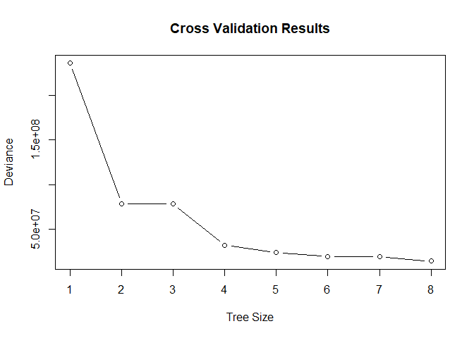
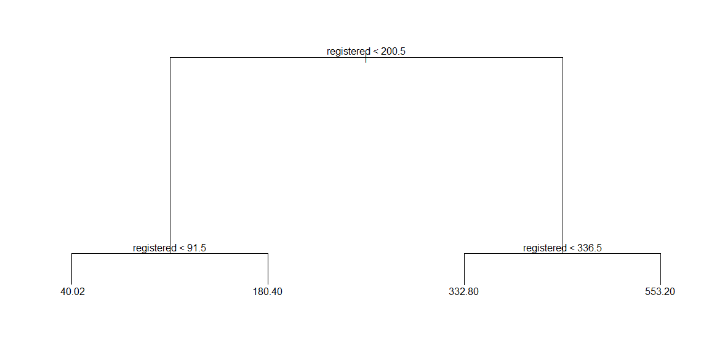
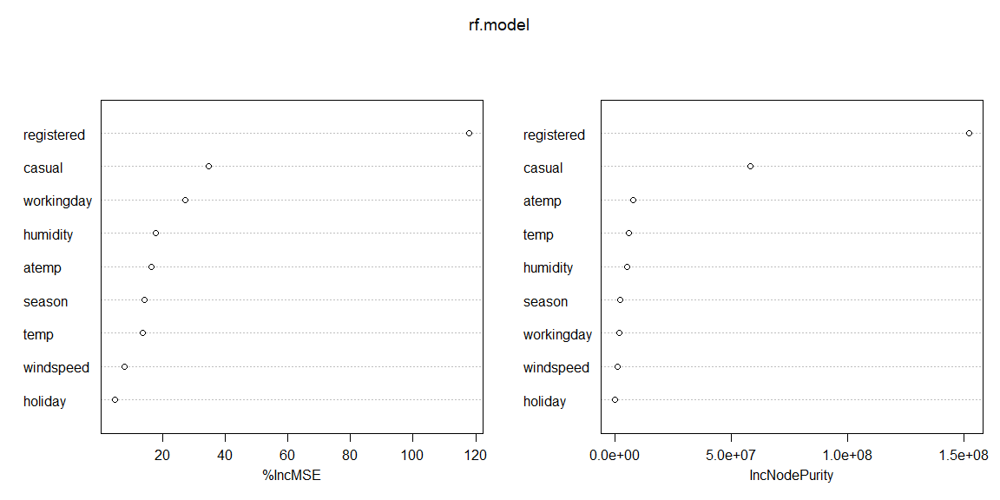

Tree Based Methods
================
by Seif Kungulio

<hr style="height:5px; border:none; color:red; background-color:red;" />

<br>

## **Bike Sharing System**

<hr style="height:2px; border:none; color:#333; background-color:#333;" />

You are working as a data scientist for the government in the city of
Washington, D.C. Currently, Washington, D.C has a bike sharing system.
People could rent a bike from one location and return it to a different
place. You are given a historical usage pattern with weather data
contained in the Excel workbook bike.csv. You are asked to forecast bike
rental demand in the capital bike share program.

**Data Source:** from Kaggle at
<https://www.kaggle.com/c/bike-sharing-demand>

<br>

### **Development Environment**

Install necessary packages if not installed

``` r
if (!requireNamespace("tree", quietly = TRUE)) {
  install.packages("tree")
}
if (!requireNamespace("randomForest", quietly = TRUE)) {
  install.packages("randomForest")
}
```

Load the required libraries

``` r
library(tree)
library(randomForest)
```

<br>

### **Data Dictionary**

**Data Source:** from MASS library in R. This dataset contains the
following columns:

| Variable | Data Type | Description | Constraints/Rules |
|:---|:---|:---|:---|
| `mpg` | Numeric | Miles per gallon | Positive values only (mpg \> 0) |
| `cyl` | Integer | Number of cylinders | Categorical: {4, 6, 8} |
| `disp` | Numeric | Displacement (cubic inches) | Positive values only (disp \> 0) |
| `hp` | Integer | Gross horsepower | Positive values only (hp \> 0) |
| `drat` | Numeric | Rear axle ratio | Positive values only (drat \> 0) |
| `wt` | Numeric | Weight (1000 lbs) | Positive values only (wt \> 0) |
| `qsec` | Numeric | 1/4 mile time (seconds) | Positive values only (qsec \> 0) |
| `vs` | Integer | Engine type: 0 = V-shaped, 1 = straight | Binary: {0, 1} |
| `am` | Integer | Transmission: 0 = automatic, 1 = manual | Binary: {0, 1} |
| `gear` | Integer | Number of forward gears | Categorical: {3, 4, 5} |
| `carb` | Integer | Number of carburetors | Positive integer values only |
|  |  |  |  |

<br>

### **Question 1:**

Load the dataset bike.csv into memory. Then split the data into a
training set containing 2/3 of the original data (test set containing
remaining 1/3 of the original data).

Read the dataset into memory

``` r
Bike.df <- read.csv("data/Bike.csv")
```

Display the dimensions of the data frame (number of rows and columns)

``` r
dim(Bike.df)
```

    ## [1] 10886    12

Display the column names of the data frame

``` r
colnames(Bike.df)
```

    ##  [1] "datetime"   "season"     "holiday"    "workingday" "weather"   
    ##  [6] "temp"       "atemp"      "humidity"   "windspeed"  "casual"    
    ## [11] "registered" "count"

Display the first six rows of the data frame to understand its structure

``` r
head(Bike.df)
```

    ##              datetime season holiday workingday weather temp  atemp humidity
    ## 1 2011-01-01 00:00:00      1       0          0       1 9.84 14.395       81
    ## 2 2011-01-01 01:00:00      1       0          0       1 9.02 13.635       80
    ## 3 2011-01-01 02:00:00      1       0          0       1 9.02 13.635       80
    ## 4 2011-01-01 03:00:00      1       0          0       1 9.84 14.395       75
    ## 5 2011-01-01 04:00:00      1       0          0       1 9.84 14.395       75
    ## 6 2011-01-01 05:00:00      1       0          0       2 9.84 12.880       75
    ##   windspeed casual registered count
    ## 1    0.0000      3         13    16
    ## 2    0.0000      8         32    40
    ## 3    0.0000      5         27    32
    ## 4    0.0000      3         10    13
    ## 5    0.0000      0          1     1
    ## 6    6.0032      0          1     1

Convert categorical variables to factors

``` r
Bike.df$season = factor(Bike.df$season,
                         levels = c(1, 2, 3, 4),
                         labels = c("Spring", "Summer", "Fall", "Winter")
)
Bike.df$holiday <- factor(Bike.df$holiday, 
                           levels = c(0,1), 
                           labels = c("No", "Yes")
)
Bike.df$workingday <- factor(Bike.df$workingday,
                              levels = c(0,1), 
                              labels = c("No", "Yes")
)
Bike.df$weather <- factor(Bike.df$weather,
                           levels = c(1, 2, 3, 4),
                           labels = c("Clear", "Misty_cloudy",
                                      "Light_snow", "Heavy_rain")
)
```

Set seed for reproducibility

``` r
set.seed(123)
```

Split the data into a training set (2/3) and test set (1/3)

``` r
trainIdx = sample(1:nrow(Bike.df), size = 2/3 * nrow(Bike.df))

# Create a training dataset out of "Bike.df"
trainData = Bike.df[trainIdx, ]

# Create a testing dataset from the remaining dataset of "Bike.df"
testData  <- Bike.df[-trainIdx, ]
```

<br>

### **Question 2:**

Build a tree model using function tree().

#### **Section A**

The response is count and the predictors are season, holiday,
workingday, temp, atemp, humidity, windspeed, casual, and registered.

``` r
# Build a tree model using function tree()
tr.model = tree(
  count ~ season + holiday + workingday + temp +
    atemp + humidity + windspeed + casual + registered,
  data = trainData
)

# Display the statistical summary of the tree
summary(tr.model)
```

    ## 
    ## Regression tree:
    ## tree(formula = count ~ season + holiday + workingday + temp + 
    ##     atemp + humidity + windspeed + casual + registered, data = trainData)
    ## Variables actually used in tree construction:
    ## [1] "registered" "casual"    
    ## Number of terminal nodes:  8 
    ## Residual mean deviance:  1875 = 13590000 / 7249 
    ## Distribution of residuals:
    ##     Min.  1st Qu.   Median     Mean  3rd Qu.     Max. 
    ## -158.000  -19.290   -3.983    0.000   18.020  259.700

- The decision tree mainly depends on the registered and casual
  variables, which seem to be the most direct predictors of bike rental
  counts.
- With 8 terminal nodes, the model reflects a moderate level of
  complexity while still managing to avoid overfitting.
- The Residual Mean Deviance (1875) and the distribution of residuals
  give insight into how well the model performs. Although there are some
  notable outliers (like -158 and +259.7), the residuals generally
  cluster around zero.
- Overall, the tree offers a simplified yet understandable view of the
  data relationships. However, its predictive accuracy could potentially
  be enhanced through hyperparameter tuning or by exploring more
  advanced models such as random forests or gradient boosting.

<br>

#### **Section B**

Perform cross-validation to choose the best tree by calling cv.tree().

``` r
CV_Bike = cv.tree(tr.model)
```

<br>

#### **Section C**

Plot the model results of b) and determine the best size of the optimal
tree.

``` r
plot(CV_Bike$size, CV_Bike$dev, type = "b",
     xlab = "Tree Size",
     ylab = "Deviance",
     main = "Cross Validation Results")
```

<!-- -->

- The plot indicates that the ideal tree size is 4.
- At this point, the deviance reaches its lowest value before leveling
  off or slightly rising with larger trees. This suggests the model
  achieves a good balance—complex enough to capture key patterns without
  being overly complicated or prone to overfitting.

<br>

#### **Section D**

Prune the tree by calling prune.tree() function with the best size found
in c).

``` r
prunedTree = prune.tree(tr.model, best = 4)
```

<br>

#### **Section E**

Plot the best tree model.

``` r
plot(prunedTree)
text(prunedTree, pretty = 0)
```

<!-- -->

- The pruned decision tree, refined to 4 terminal nodes through
  cross-validation, forecasts a numeric target variable. It begins by
  splitting on the **`registered`** variable, with the initial split at
  **`registered` \< 200.5**. Subsequent splits lead to four final
  predicted values: 40.02, 180.40, 332.80, and 553.20.
- This streamlined version of the tree is more interpretable, reduces
  the risk of overfitting, and maintains solid predictive power by
  emphasizing the most impactful decision points.

<br>

#### **Section F**

Compute the test error using the test data set.

``` r
tr.predictions = predict(prunedTree, newdata = testData)

#compute and display the MSE
tr.mse <- mean((tr.predictions - testData$count)^2)
tr.mse
```

    ## [1] 4762.857

- The Mean Squared Error (MSE) of **4762.857** gives a numerical
  indication of the average difference between the model’s predictions
  and the actual values in the test dataset.
- Whether this MSE is considered good or bad depends on the scale of the
  target variable **`count`**.
  - For example, if **`count`** values usually fall in the thousands,
    this level of error might be reasonable. But if the values are much
    smaller, the error could be considered quite large in comparison.

<br>

### **Question 3:**

Build a random forest model using function randomForest().

#### **Section A**

The response is **`count`** and the predictors are **`season`**,
**`holiday`**, **`workingday`**, **`temp`**, **`atemp`**,
**`humidity`**, **`windspeed`**, **`casual`**, and **`registered`**.

``` r
set.seed(123)  # Set seed for reproducibility
rf.model = randomForest(count ~ season + holiday + workingday + temp + 
                          atemp + humidity + windspeed + casual + registered,
                        data = trainData, importance = TRUE)

# Print the random forest model result
print(rf.model)
```

    ## 
    ## Call:
    ##  randomForest(formula = count ~ season + holiday + workingday +      temp + atemp + humidity + windspeed + casual + registered,      data = trainData, importance = TRUE) 
    ##                Type of random forest: regression
    ##                      Number of trees: 500
    ## No. of variables tried at each split: 3
    ## 
    ##           Mean of squared residuals: 130.3723
    ##                     % Var explained: 99.6

- The Random Forest model performs exceptionally well on the training
  data, accounting for 99.6% of the variance and showing a low residual
  error of 130.3723. However, this strong performance might suggest
  overfitting, so it’s important to validate the model on unseen test
  data.
- Using 500 trees and 3 variables at each split, the model strikes a
  good balance between precision and computational efficiency.
- To determine which features, have the greatest impact on predictions,
  tools like **`importance()`** or **`varImpPlot()`** can be used to
  assess variable importance.

<br>

#### **Section B**

Compute the test error using the test data set.

``` r
rf.predictions = predict(rf.model, newdata = testData)

# Calculate the mean squared error
rf.mse <- mean((rf.predictions - testData$count)^2)
rf.mse
```

    ## [1] 177.4572

- The test Mean Squared Error (MSE) of **177.457** reflects strong
  predictive accuracy on new data, although it’s slightly higher than
  the training error of 130.3723—indicating a minor degree of
  overfitting.
- Overall, the model demonstrates solid performance, with only a small
  drop in accuracy from training to testing, which is a normal and
  expected outcome in most modeling scenarios.

<br>

#### **Section C**

Extract variable importance measure using **`importance()`** function.

``` r
importance(rf.model)
```

    ##               %IncMSE IncNodePurity
    ## season      14.332261    2084868.26
    ## holiday      4.836423      77828.05
    ## workingday  27.288525    2036925.63
    ## temp        13.620187    6064088.53
    ## atemp       16.569101    7734568.86
    ## humidity    17.822489    5095570.13
    ## windspeed    7.787657    1215118.78
    ## casual      34.829490   58165642.18
    ## registered 117.913863  152055043.04

- The variable **`registered`** plays the most significant role in
  predicting the target variable **`count`**, with **`casual`** and
  **`workingday`** also contributing notably.
- In contrast, features such as **`holiday`** and **`windspeed`** have
  little influence on the model’s predictive capability.
- These findings can guide model simplification by removing less impact
  variables and highlight the main drivers behind the predictions.

<br>

#### **Section D**

Plot the variable importance using function **`varImpPlot()`**. Which
are the top 2 important predictors in this model?

``` r
varImpPlot(rf.model)
```

<!-- -->

- **`Registered`** and **`casual`** are the top predictors, playing a
  major role in improving the model’s accuracy and reducing variance.
- The model relies heavily on these two variables, indicating they are
  the primary factors affecting the target variable, **`count`**.
